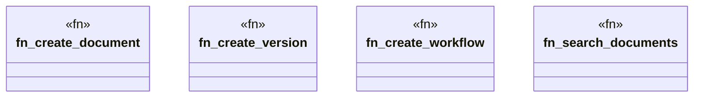

# `marketplace/packages/document-management-system/examples/rust/src/main.rs`

Source SHA-256: `3b3b6ab69a2dce6fe5250eaea19c5a889bf7db081fddd52547194c83c30e789e`

## Dependencies

- `oxigraph::model::*`
- `oxigraph::sparql::QueryResults`
- `oxigraph::store::Store`
- `std::error::Error`

## Standing

- Structural parse: `ALIVE`
- Runtime behavior: `UNKNOWN`
