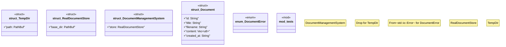

# `marketplace/packages/document-management-system/tests/chicago_tdd_tests.rs`

Source SHA-256: `d6ef71ee64fbaf463c676878916b644433eb28454f23d8f60b2bf783a61aa4b5`

## Dependencies

- `std::fs`
- `std::path::{Path, PathBuf}`
- `std::sync::{Arc, Mutex}`
- `std::thread`
- `std::time::Instant`
- `super::*`

## Standing

- Structural parse: `ALIVE`
- Runtime behavior: `UNKNOWN`
