# `marketplace/packages/enterprise-erp-core/templates/rust/accounting_engine.rs`

Source SHA-256: `8e9e525f0b9e0ef522a5c275dfc16b2e7c2b8493f61333e8a0964f78d8a6444d`

```mermaid
classDiagram
    class enum_AccountType {
      <<enum>>
    }
    class struct_Account {
      <<struct>>
      +"number: String"
      +"name: String"
      +"account_type: AccountType"
      +"parent: Option~String~"
      +"is_active: bool"
      +"requires_department: bool"
    }
    class struct_JournalLine {
      <<struct>>
      +"account: String"
      +"debit: Decimal"
      +"credit: Decimal"
      +"department: Option~String~"
      +"memo: Option~String~"
    }
    class struct_JournalEntry {
      <<struct>>
      +"entry_number: String"
      +"entry_date: NaiveDate"
      +"description: String"
      +"lines: Vec~JournalLine~"
      +"is_reversing: bool"
      +"created_by: String"
      +"created_at: DateTime~Utc~"
    }
    class struct_TrialBalance {
      <<struct>>
      +"as_of_date: NaiveDate"
      +"accounts: Vec~TrialBalanceAccount~"
    }
    class struct_TrialBalanceAccount {
      <<struct>>
      +"account_number: String"
      +"account_name: String"
      +"debit_total: Decimal"
      +"credit_total: Decimal"
      +"balance: Decimal"
    }
    class struct_AccountingEngine {
      <<struct>>
      +"accounts: HashMap~String"
      +"entries: Vec~JournalEntry~"
    }
    class mod_tests {
      <<mod>>
    }
    note "AccountingEngine"
```

## Dependencies

- `chrono::{DateTime, Utc, NaiveDate}`
- `rust_decimal::Decimal`
- `serde::{Deserialize, Serialize}`
- `std::collections::HashMap`
- `super::*`

## Standing

- Structural parse: `ALIVE`
- Runtime behavior: `UNKNOWN`
