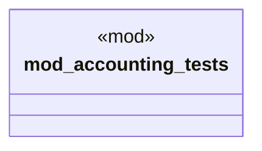

# `marketplace/packages/enterprise-erp-core/tests/chicago_tdd/test_accounting.rs`

Source SHA-256: `72005b7d0a7b78e868ded0a009a220e7fd207851814621ef1ecb078a8ad66d7a`

## Dependencies

- `accounting_engine::*`
- `chrono::NaiveDate`
- `rust_decimal::Decimal`
- `super::*`

## Standing

- Structural parse: `ALIVE`
- Runtime behavior: `UNKNOWN`
