# `marketplace/packages/graphql-api-template/templates/rust/schema.rs`

Source SHA-256: `d8516e30d30fccb4992f9e63d758c02cc4bf01af4877908a0fd56cb05ba800ad`

```mermaid
classDiagram
    class struct_User {
      <<struct>>
      +"id: ID"
      +"name: String"
      +"email: String"
    }
    class struct_Post {
      <<struct>>
      +"id: ID"
      +"title: String"
      +"content: String"
      +"author_id: ID"
    }
    class struct_UserByIdLoader {
      <<struct>>
      +"pool: PgPool"
    }
    class struct_PostsByUserLoader {
      <<struct>>
      +"pool: PgPool"
    }
    class struct_CreateUserInput {
      <<struct>>
      +"name: String"
      +"email: String"
    }
    class struct_UpdateUserInput {
      <<struct>>
      +"name: Option~String~"
      +"email: Option~String~"
    }
    class enum_Role {
      <<enum>>
    }
    class struct_RoleGuard {
      <<struct>>
      +"role: Role"
    }
    class struct_QueryRoot {
      <<struct>>
    }
    class struct_MutationRoot {
      <<struct>>
    }
    class enum_UserEvent {
      <<enum>>
    }
    class struct_SubscriptionRoot {
      <<struct>>
    }
    class type_AppSchema {
      <<type>>
    }
    class fn_build_schema {
      <<fn>>
    }
    note "Guard for RoleGuard"
    note "Loader~ID~ for PostsByUserLoader"
    note "Loader~ID~ for UserByIdLoader"
    note "MutationRoot"
    note "Post"
    note "QueryRoot"
    note "RoleGuard"
    note "SubscriptionRoot"
    note "User"
```

## Dependencies

- `async_graphql::*`
- `async_graphql::dataloader::{DataLoader, Loader}`
- `futures::stream::Stream`
- `sqlx::PgPool`
- `std::collections::HashMap`

## Standing

- Structural parse: `ALIVE`
- Runtime behavior: `UNKNOWN`
