# `marketplace/packages/healthcare/dicom-medical-imaging/templates/rust/dicom_parser.rs`

Source SHA-256: `7733bff81ff7d536825175e0dbabb34674d30e88b4a29d90f28780a14bb286ad`

```mermaid
classDiagram
    class struct_DICOMFile {
      <<struct>>
      +"patient: PatientInfo"
      +"study: StudyInfo"
      +"series: SeriesInfo"
      +"instance: InstanceInfo"
      +"tags: HashMap~String"
    }
    class struct_PatientInfo {
      <<struct>>
      +"patient_name: Option~String~"
      +"patient_id: Option~String~"
      +"patient_birth_date: Option~String~"
      +"patient_sex: Option~String~"
      +"patient_age: Option~String~"
    }
    class struct_StudyInfo {
      <<struct>>
      +"study_instance_uid: String"
      +"study_date: Option~String~"
      +"study_time: Option~String~"
      +"study_description: Option~String~"
      +"accession_number: Option~String~"
      +"referring_physician_name: Option~String~"
    }
    class struct_SeriesInfo {
      <<struct>>
      +"series_instance_uid: String"
      +"series_number: Option~i32~"
      +"modality: Option~String~"
      +"series_description: Option~String~"
      +"body_part_examined: Option~String~"
    }
    class struct_InstanceInfo {
      <<struct>>
      +"sop_instance_uid: String"
      +"sop_class_uid: Option~String~"
      +"instance_number: Option~i32~"
      +"rows: Option~i32~"
      +"columns: Option~i32~"
      +"bits_allocated: Option~i32~"
    }
    class struct_DICOMParser {
      <<struct>>
    }
    class struct_WADOClient {
      <<struct>>
      +"base_url: String"
    }
    class mod_tests {
      <<mod>>
    }
    note "DICOMParser"
    note "WADOClient"
```

## Dependencies

- `serde::{Deserialize, Serialize}`
- `std::collections::HashMap`
- `super::*`

## Standing

- Structural parse: `ALIVE`
- Runtime behavior: `UNKNOWN`
