# `marketplace/packages/healthcare/fhir-patient-management/templates/rust/fhir_server.rs`

Source SHA-256: `c8300bb0227783b2ba7793952a4666ea94c615f29b2488578e9bff30b6bfb404`

```mermaid
classDiagram
    class struct_Patient {
      <<struct>>
      +"resource_type: String"
      +"id: Option~String~"
      +"identifier: Vec~Identifier~"
      +"active: Option~bool~"
      +"name: Vec~HumanName~"
      +"telecom: Option~Vec~ContactPoint~~"
      +"gender: Option~String~"
      +"birth_date: Option~String~"
      +"deceased: Option~Deceased~"
      +"address: Option~Vec~Address~~"
      +"marital_status: Option~CodeableConcept~"
    }
    class struct_Observation {
      <<struct>>
      +"resource_type: String"
      +"id: Option~String~"
      +"status: String"
      +"category: Option~Vec~CodeableConcept~~"
      +"code: CodeableConcept"
      +"subject: Reference"
      +"effective_date_time: Option~String~"
      +"value: Option~ObservationValue~"
      +"interpretation: Option~Vec~CodeableConcept~~"
      +"reference_range: Option~Vec~ReferenceRange~~"
    }
    class struct_MedicationRequest {
      <<struct>>
      +"resource_type: String"
      +"id: Option~String~"
      +"status: String"
      +"intent: String"
      +"medication: CodeableConcept"
      +"subject: Reference"
      +"authored_on: Option~String~"
      +"requester: Option~Reference~"
      +"dosage_instruction: Option~Vec~Dosage~~"
    }
    class struct_Condition {
      <<struct>>
      +"resource_type: String"
      +"id: Option~String~"
      +"clinical_status: CodeableConcept"
      +"verification_status: Option~CodeableConcept~"
      +"severity: Option~CodeableConcept~"
      +"code: CodeableConcept"
      +"subject: Reference"
      +"onset_date_time: Option~String~"
    }
    class struct_Identifier {
      <<struct>>
      +"use_: Option~String~"
      +"system: Option~String~"
      +"value: String"
    }
    class struct_HumanName {
      <<struct>>
      +"use_: Option~String~"
      +"text: Option~String~"
      +"family: Option~String~"
      +"given: Option~Vec~String~~"
      +"prefix: Option~Vec~String~~"
      +"suffix: Option~Vec~String~~"
    }
    class struct_ContactPoint {
      <<struct>>
      +"system: Option~String~"
      +"value: Option~String~"
      +"use_: Option~String~"
    }
    class struct_Address {
      <<struct>>
      +"use_: Option~String~"
      +"line: Option~Vec~String~~"
      +"city: Option~String~"
      +"state: Option~String~"
      +"postal_code: Option~String~"
      +"country: Option~String~"
    }
    class struct_CodeableConcept {
      <<struct>>
      +"coding: Option~Vec~Coding~~"
      +"text: Option~String~"
    }
    class struct_Coding {
      <<struct>>
      +"system: Option~String~"
      +"code: Option~String~"
      +"display: Option~String~"
    }
    class struct_Reference {
      <<struct>>
      +"reference: Option~String~"
      +"display: Option~String~"
    }
    class enum_Deceased {
      <<enum>>
    }
    class enum_ObservationValue {
      <<enum>>
    }
    class struct_Quantity {
      <<struct>>
      +"value: Option~f64~"
      +"unit: Option~String~"
      +"system: Option~String~"
      +"code: Option~String~"
    }
    class struct_ReferenceRange {
      <<struct>>
      +"low: Option~Quantity~"
      +"high: Option~Quantity~"
    }
    class struct_Dosage {
      <<struct>>
      +"text: Option~String~"
      +"timing: Option~Timing~"
      +"dose_and_rate: Option~Vec~DoseAndRate~~"
    }
    class struct_Timing {
      <<struct>>
      +"repeat: Option~TimingRepeat~"
    }
    class struct_TimingRepeat {
      <<struct>>
      +"frequency: Option~i32~"
      +"period: Option~f64~"
      +"period_unit: Option~String~"
    }
    class struct_DoseAndRate {
      <<struct>>
      +"dose_quantity: Option~Quantity~"
    }
    class struct_Bundle {
      <<struct>>
      +"resource_type: String"
      +"type_: String"
      +"total: Option~u32~"
      +"entry: Vec~BundleEntry~"
    }
    class struct_BundleEntry {
      <<struct>>
      +"resource: serde_json::Value"
    }
    class struct_FHIRServer {
      <<struct>>
      +"patients: Arc~RwLock~HashMap~String"
      +"observations: Arc~RwLock~HashMap~String"
      +"medications: Arc~RwLock~HashMap~String"
      +"conditions: Arc~RwLock~HashMap~String"
    }
    class mod_tests {
      <<mod>>
    }
    note "FHIRServer"
```

## Dependencies

- `serde::{Deserialize, Serialize}`
- `std::collections::HashMap`
- `std::sync::{Arc, RwLock}`
- `super::*`

## Standing

- Structural parse: `ALIVE`
- Runtime behavior: `UNKNOWN`
