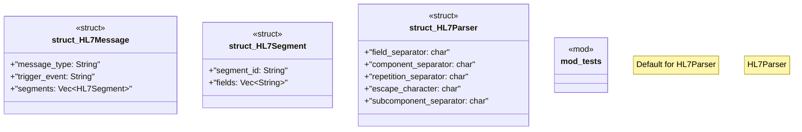

# `marketplace/packages/healthcare/hl7-v2-integration/templates/rust/hl7_parser.rs`

Source SHA-256: `4480b70e3af5bc36b4445b3d98b1bdeb34a515e744ff5460b861ae171d3274d5`

## Dependencies

- `std::collections::HashMap`
- `super::*`

## Standing

- Structural parse: `ALIVE`
- Runtime behavior: `UNKNOWN`
