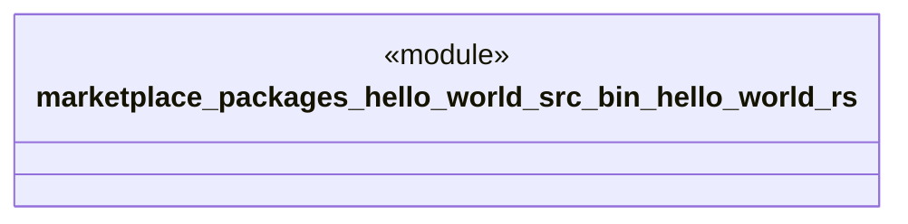

# `marketplace/packages/hello-world/src/bin/hello-world.rs`

Source SHA-256: `1572911d10b15dd7963101dc5c7ea134fa4fc13d3429a325c0bca22c7b3f0514`

## Dependencies

- `hello_world_utils::{examples, HelloConfig, HelloWorld}`

## Standing

- Structural parse: `ALIVE`
- Runtime behavior: `UNKNOWN`
