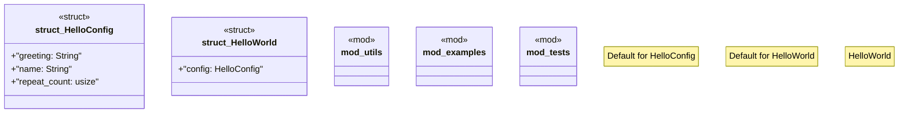

# `marketplace/packages/hello-world/src/lib.rs`

Source SHA-256: `03ac0eaea5ca4eb23a681c29d5be44bc6e588c04d436dd5a14bf2c2416b45095`

## Dependencies

- `anyhow::Result`
- `serde::{Deserialize, Serialize}`
- `super::*`

## Standing

- Structural parse: `ALIVE`
- Runtime behavior: `UNKNOWN`
