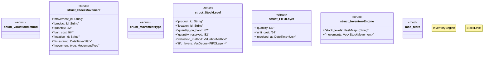

# `marketplace/packages/inventory-management/templates/rust/inventory_engine.rs`

Source SHA-256: `4a940d3f6240f73ecfcd8ce7b4ee34c947bb44f5c78f3680109385994b7fede5`

## Dependencies

- `chrono::{DateTime, Utc}`
- `std::collections::{HashMap, VecDeque}`
- `super::*`

## Standing

- Structural parse: `ALIVE`
- Runtime behavior: `UNKNOWN`
