# `marketplace/packages/iso-20022-payments/templates/rust/src/lib.rs`

Source SHA-256: `b9d17df45c12353ae42193b48cecd9335d4d3cc45241a31ae26d57dd7afe8eab`

```mermaid
classDiagram
    class struct_CustomerCreditTransferInitiation {
      <<struct>>
      +"group_header: GroupHeader"
      +"payment_information: Vec~PaymentInformation~"
    }
    class struct_GroupHeader {
      <<struct>>
      +"message_identification: String"
      +"creation_date_time: DateTime~Utc~"
      +"number_of_transactions: u32"
      +"control_sum: Decimal"
      +"initiating_party: Party"
    }
    class struct_PaymentInformation {
      <<struct>>
      +"payment_information_identification: String"
      +"payment_method: PaymentMethod"
      +"requested_execution_date: NaiveDate"
      +"debtor: Party"
      +"debtor_account: Account"
      +"debtor_agent: FinancialInstitution"
      +"credit_transfer_transactions: Vec~CreditTransferTransaction~"
    }
    class enum_PaymentMethod {
      <<enum>>
    }
    class struct_CreditTransferTransaction {
      <<struct>>
      +"payment_identification: PaymentIdentification"
      +"instructed_amount: Amount"
      +"creditor: Party"
      +"creditor_account: Account"
      +"creditor_agent: FinancialInstitution"
      +"remittance_information: Option~RemittanceInformation~"
    }
    class struct_PaymentIdentification {
      <<struct>>
      +"instruction_identification: String"
      +"end_to_end_identification: String"
    }
    class struct_Party {
      <<struct>>
      +"name: String"
      +"postal_address: Option~PostalAddress~"
    }
    class struct_PostalAddress {
      <<struct>>
      +"country: String"
      +"address_line: Vec~String~"
    }
    class struct_Account {
      <<struct>>
      +"iban: Option~String~"
      +"other: Option~String~"
    }
    class struct_FinancialInstitution {
      <<struct>>
      +"bic: Option~String~"
      +"name: Option~String~"
    }
    class struct_Amount {
      <<struct>>
      +"value: Decimal"
      +"currency: String"
    }
    class struct_RemittanceInformation {
      <<struct>>
      +"unstructured: Option~Vec~String~~"
      +"structured: Option~StructuredRemittance~"
    }
    class struct_StructuredRemittance {
      <<struct>>
      +"creditor_reference_information: CreditorReferenceInformation"
    }
    class struct_CreditorReferenceInformation {
      <<struct>>
      +"reference: String"
      +"reference_type: String"
    }
    class fn_generate_pain001_xml {
      <<fn>>
    }
    class fn_validate_iban {
      <<fn>>
    }
    class fn_validate_bic {
      <<fn>>
    }
    class mod_tests {
      <<mod>>
    }
```

## Dependencies

- `chrono::{DateTime, NaiveDate, Utc}`
- `rust_decimal::Decimal`
- `serde::{Deserialize, Serialize}`
- `std::error::Error`
- `super::*`

## Standing

- Structural parse: `ALIVE`
- Runtime behavior: `UNKNOWN`
