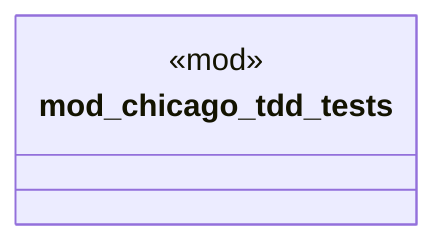

# `marketplace/packages/iso-20022-payments/tests/chicago_tdd/iso20022_tests.rs`

Source SHA-256: `93311ba4d6bbc88c41ba65e78e73bd60f1e97c13127af0b24b3b617e1761ef8c`

## Dependencies

- `std::time::Instant`
- `super::*`

## Standing

- Structural parse: `ALIVE`
- Runtime behavior: `UNKNOWN`
