# `marketplace/packages/kyc-aml-compliance/templates/rust/src/lib.rs`

Source SHA-256: `93be7034d5cb53898a237ec4e7fc05962893157316515682ea097149c4d2faa5`

```mermaid
classDiagram
    class struct_Customer {
      <<struct>>
      +"customer_id: String"
      +"full_name: String"
      +"date_of_birth: Option~NaiveDate~"
      +"nationality: Option~String~"
      +"country_of_residence: String"
      +"customer_type: CustomerType"
    }
    class enum_CustomerType {
      <<enum>>
    }
    class struct_SanctionsListEntry {
      <<struct>>
      +"entry_id: String"
      +"full_name: String"
      +"aliases: Vec~String~"
      +"date_of_birth: Option~NaiveDate~"
      +"nationality: Option~String~"
      +"list_type: SanctionsListType"
    }
    class enum_SanctionsListType {
      <<enum>>
    }
    class struct_SanctionsMatch {
      <<struct>>
      +"customer_id: String"
      +"entry_id: String"
      +"match_score: f64"
      +"match_type: MatchType"
      +"list_type: SanctionsListType"
      +"matched_field: String"
    }
    class enum_MatchType {
      <<enum>>
    }
    class struct_RiskAssessment {
      <<struct>>
      +"customer_id: String"
      +"risk_score: u32"
      +"risk_level: RiskLevel"
      +"risk_factors: Vec~RiskFactor~"
      +"assessment_date: DateTime~Utc~"
    }
    class enum_RiskLevel {
      <<enum>>
    }
    class struct_RiskFactor {
      <<struct>>
      +"factor_type: RiskFactorType"
      +"score: u32"
      +"description: String"
    }
    class enum_RiskFactorType {
      <<enum>>
    }
    class struct_SanctionsScreeningEngine {
      <<struct>>
      +"sanctions_lists: HashMap~SanctionsListType"
      +"exact_match_threshold: f64"
      +"fuzzy_match_threshold: f64"
    }
    class struct_RiskScoringEngine {
      <<struct>>
      +"high_risk_countries: Vec~String~"
      +"medium_risk_countries: Vec~String~"
    }
    class mod_tests {
      <<mod>>
    }
    note "RiskScoringEngine"
    note "SanctionsScreeningEngine"
```

## Dependencies

- `chrono::{DateTime, Utc, NaiveDate}`
- `serde::{Deserialize, Serialize}`
- `std::collections::HashMap`
- `super::*`

## Standing

- Structural parse: `ALIVE`
- Runtime behavior: `UNKNOWN`
