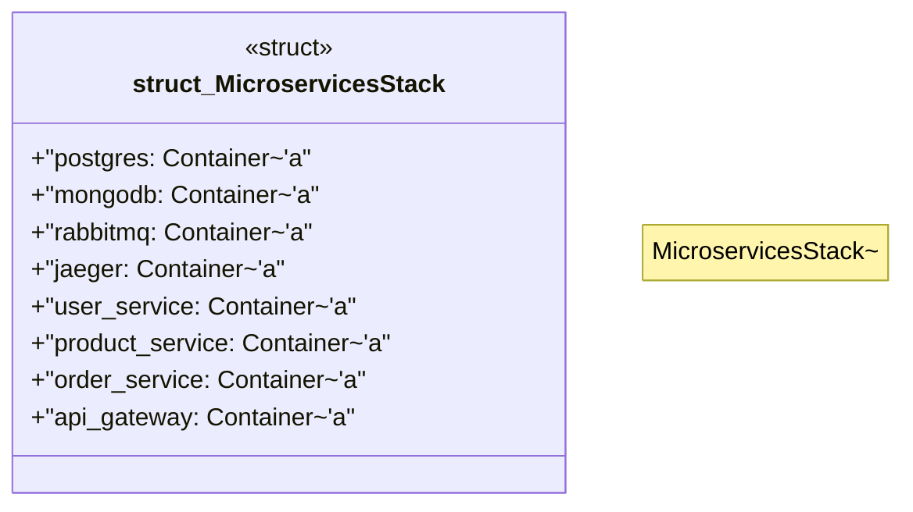

# `marketplace/packages/microservices-architecture-template/tests/chicago_tdd/test_microservices_integration.rs`

Source SHA-256: `7e2eefed5f10fec54861f95b3dc7d00f6f514019e4cd8c75006350ea6a8a5cba`

## Dependencies

- `reqwest::Client`
- `serde_json::json`
- `std::time::Duration`
- `testcontainers::{clients::Cli, images::generic::GenericImage, Container}`
- `tokio::time::sleep`

## Standing

- Structural parse: `ALIVE`
- Runtime behavior: `UNKNOWN`
