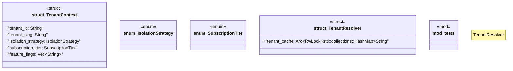

# `marketplace/packages/multi-tenant-saas/templates/rust/tenant_middleware.rs`

Source SHA-256: `ef4f93623dd3539230d4dba04a4453ce5749f44868b194bdc899bf2252ee5bdd`

## Dependencies

- `axum::{ extract::{Extension, Request}, http::{HeaderMap, StatusCode}, middleware::Next, response::Response, }`
- `std::sync::Arc`
- `super::*`
- `tokio::sync::RwLock`

## Standing

- Structural parse: `ALIVE`
- Runtime behavior: `UNKNOWN`
