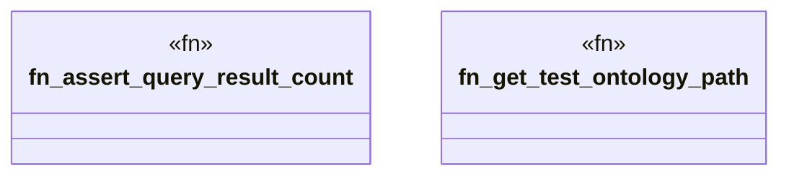

# `marketplace/packages/multi-tenant-saas/tests/chicago_tdd/multi_tenant_tests.rs`

Source SHA-256: `645f0667f34108114378626655b9f755ae69285854998a245bf9ea79e0b01ea3`

## Dependencies

- `anyhow::Result`
- `ggen_core::Graph`
- `ggen_core::domain::graph::{execute_query, QueryInput}`
- `std::fs`
- `std::path::PathBuf`
- `tempfile::TempDir`

## Standing

- Structural parse: `ALIVE`
- Runtime behavior: `UNKNOWN`
