# `marketplace/packages/notification-messaging-hub/src/rust/lib.rs`

Source SHA-256: `4083efe9a553b68e5510b00cc8cfbe59550e4e1fd98969b8150d4521dabe48d3`

```mermaid
classDiagram
    class enum_MessagePriority {
      <<enum>>
    }
    class enum_DeliveryStatus {
      <<enum>>
    }
    class enum_Channel {
      <<enum>>
    }
    class struct_Message {
      <<struct>>
      +"id: String"
      +"subject: Option~String~"
      +"body: String"
      +"html_body: Option~String~"
      +"priority: MessagePriority"
      +"channel: Channel"
      +"recipient_ids: Vec~String~"
      +"template_id: Option~String~"
      +"template_vars: HashMap~String"
      +"created_at: DateTime~Utc~"
      +"scheduled_at: Option~DateTime~Utc~~"
      +"expires_at: Option~DateTime~Utc~~"
      +"metadata: HashMap~String"
    }
    class struct_DeliveryAttempt {
      <<struct>>
      +"message_id: String"
      +"attempt_number: u32"
      +"status: DeliveryStatus"
      +"provider: String"
      +"attempted_at: DateTime~Utc~"
      +"completed_at: Option~DateTime~Utc~~"
      +"failure_reason: Option~String~"
      +"response_time_ms: Option~u64~"
    }
    class struct_RateLimit {
      <<struct>>
      +"channel: Channel"
      +"max_per_minute: u32"
      +"max_per_hour: u32"
      +"max_per_day: u32"
      +"burst_size: u32"
    }
    class trait_MessageProvider {
      <<trait>>
      +"send(&self, message: &Message) -~ Result~DeliveryAttempt, Box~dyn std::error::Error~~"
      +"get_status(&self, message_id: &str) -~ Result~DeliveryStatus, Box~dyn std::error::Error~~"
      +"supports_channel(&self, channel: &Channel) -~ bool"
      +"provider_name(&self) -~ &str"
    }
    class trait_MessageQueue {
      <<trait>>
      +"enqueue(&self, message: Message) -~ Result~(), Box~dyn std::error::Error~~"
      +"dequeue(&self, count: usize) -~ Result~Vec~Message~, Box~dyn std::error::Error~~"
      +"peek(&self, count: usize) -~ Result~Vec~Message~, Box~dyn std::error::Error~~"
      +"depth(&self) -~ Result~usize, Box~dyn std::error::Error~~"
      +"acknowledge(&self, message_id: &str) -~ Result~(), Box~dyn std::error::Error~~"
    }
    class struct_NotificationHub {
      <<struct>>
      +"providers: HashMap~Channel"
      +"queues: HashMap~Channel"
      +"rate_limits: HashMap~Channel"
    }
    class mod_tests {
      <<mod>>
    }
    note "Message"
    note "NotificationHub"
    note "RateLimit"
```

## Dependencies

- `async_trait::async_trait`
- `chrono::{DateTime, Utc, Duration}`
- `serde::{Deserialize, Serialize}`
- `std::collections::HashMap`
- `super::*`

## Standing

- Structural parse: `ALIVE`
- Runtime behavior: `UNKNOWN`
