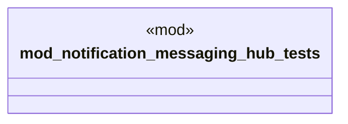

# `marketplace/packages/notification-messaging-hub/tests/chicago_tdd.rs`

Source SHA-256: `1136cdd229d41687ecea3e001b679e1443d82a75b0216abaf44455bc31fa034f`

## Dependencies

- `std::time::Instant`

## Standing

- Structural parse: `ALIVE`
- Runtime behavior: `UNKNOWN`
