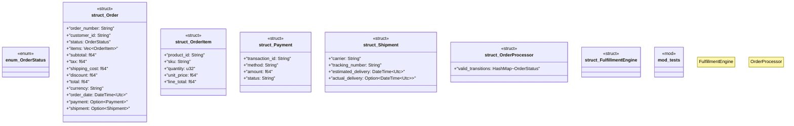

# `marketplace/packages/order-management-system/templates/rust/order_processor.rs`

Source SHA-256: `c25dd25b1baa3ee0126e2ecd487d8d1a707a01572693c94203038719609b7255`

## Dependencies

- `chrono::{DateTime, Utc}`
- `serde::{Deserialize, Serialize}`
- `std::collections::HashMap`
- `super::*`

## Standing

- Structural parse: `ALIVE`
- Runtime behavior: `UNKNOWN`
