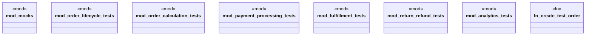

# `marketplace/packages/order-management-system/tests/chicago_tdd/order_processor_tests.rs`

Source SHA-256: `499a1745b8cbb2cf175b4ebc3aacb850612e43e10a37411ea5302a6183b9de87`

## Dependencies

- `chrono::Utc`
- `mocks::*`
- `std::collections::HashMap`
- `super::*`

## Standing

- Structural parse: `ALIVE`
- Runtime behavior: `UNKNOWN`
