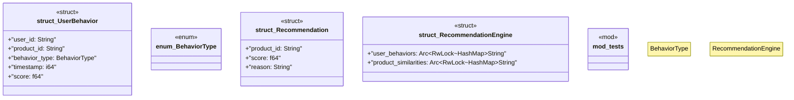

# `marketplace/packages/product-recommendations/templates/rust/recommendation_engine.rs`

Source SHA-256: `bcd3a14798f02a6f0560f3b759633ba416797dce501f629a6a1fe04a5fc0baba`

## Dependencies

- `std::collections::{HashMap, HashSet}`
- `std::sync::Arc`
- `super::*`
- `tokio::sync::RwLock`

## Standing

- Structural parse: `ALIVE`
- Runtime behavior: `UNKNOWN`
