# `marketplace/packages/project-management/tests/chicago_tdd_tests.rs`

Source SHA-256: `b59c40920b37111fa37c65d759a9985ce35a24e87f2b43190b036af29fdcc6d5`

```mermaid
classDiagram
    class struct_CreateProjectRequest {
      <<struct>>
      +"name: String"
      +"budget: f64"
    }
    class enum_DependencyType {
      <<enum>>
    }
    class struct_UserStoryRequest {
      <<struct>>
      +"title: String"
      +"story_points: i32"
    }
    class enum_PMError {
      <<enum>>
    }
    class struct_Project {
      <<struct>>
      +"id: String"
    }
    class struct_Task {
      <<struct>>
      +"id: String"
    }
    class struct_Resource {
      <<struct>>
      +"id: String"
    }
    class struct_ProjectStatus {
      <<struct>>
      +"overall_progress: i32"
    }
    class struct_UserStory {
      <<struct>>
      +"id: String"
    }
    class struct_Sprint {
      <<struct>>
      +"id: String"
    }
    class struct_VelocityMetrics {
      <<struct>>
      +"planned_points: i32"
      +"completed_points: i32"
      +"velocity: i32"
    }
    class struct_GanttChart {
      <<struct>>
      +"tasks: Vec~GanttTask~"
      +"critical_path: Vec~String~"
    }
    class struct_GanttTask {
      <<struct>>
      +"id: String"
      +"name: String"
      +"start: String"
      +"end: String"
      +"dependencies: Vec~String~"
    }
    class struct_ProjectManagement {
      <<struct>>
    }
    class mod_tests {
      <<mod>>
    }
    note "ProjectManagement"
```

## Dependencies

- `std::sync::{Arc, Mutex}`
- `std::thread`
- `std::time::Instant`
- `super::*`

## Standing

- Structural parse: `ALIVE`
- Runtime behavior: `UNKNOWN`
