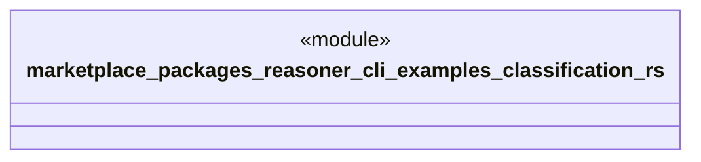

# `marketplace/packages/reasoner-cli/examples/classification.rs`

Source SHA-256: `3a90520cfa35695695048f588b79b7891ffe6f0743eae3b154e9a0195c5e9375`

## Dependencies

- `reasoner_cli::Result`

## Standing

- Structural parse: `ALIVE`
- Runtime behavior: `UNKNOWN`
