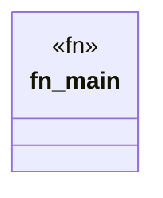

# `marketplace/packages/reasoner-cli/examples/consistency.rs`

Source SHA-256: `aa56d1ddba3ab86b1635bc83222bd997e4c411faa6855ebbb47609ec111285bb`

## Dependencies

- `anyhow::Result`
- `reasoner_cli::{OWLProfile, Reasoner, ReasonerType}`
- `std::fs`

## Standing

- Structural parse: `ALIVE`
- Runtime behavior: `UNKNOWN`
