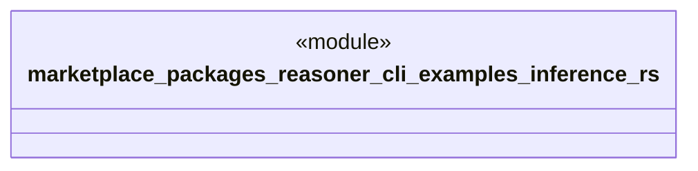

# `marketplace/packages/reasoner-cli/examples/inference.rs`

Source SHA-256: `d418062063cbc33e0a25f4e486cd464927004580e88651a0a67f378de0a64f68`

## Dependencies

- `reasoner_cli::Result`

## Standing

- Structural parse: `ALIVE`
- Runtime behavior: `UNKNOWN`
