# `marketplace/packages/reasoner-cli/src/lib.rs`

Source SHA-256: `3ef1db4dd2c65ea3ffa0807b0438cfb5eca6774d4686de879d2df0bb9300f1d9`

```mermaid
classDiagram
    class type_Result {
      <<type>>
    }
    class struct_ClassifierCmd {
      <<struct>>
      +"action: ClassifierAction"
    }
    class enum_ClassifierAction {
      <<enum>>
    }
    class struct_OntologyCmd {
      <<struct>>
      +"action: OntologyAction"
    }
    class enum_OntologyAction {
      <<enum>>
    }
    class struct_InferenceCmd {
      <<struct>>
      +"action: InferenceAction"
    }
    class enum_InferenceAction {
      <<enum>>
    }
    class struct_ValidatorCmd {
      <<struct>>
      +"action: ValidatorAction"
    }
    class enum_ValidatorAction {
      <<enum>>
    }
    class mod_tests {
      <<mod>>
    }
    note "ClassifierCmd"
    note "InferenceCmd"
    note "OntologyCmd"
    note "ValidatorCmd"
```

## Dependencies

- `clap::{Parser, Subcommand}`
- `serde::{Deserialize, Serialize}`
- `std::path::PathBuf`
- `super::*`

## Standing

- Structural parse: `ALIVE`
- Runtime behavior: `UNKNOWN`
