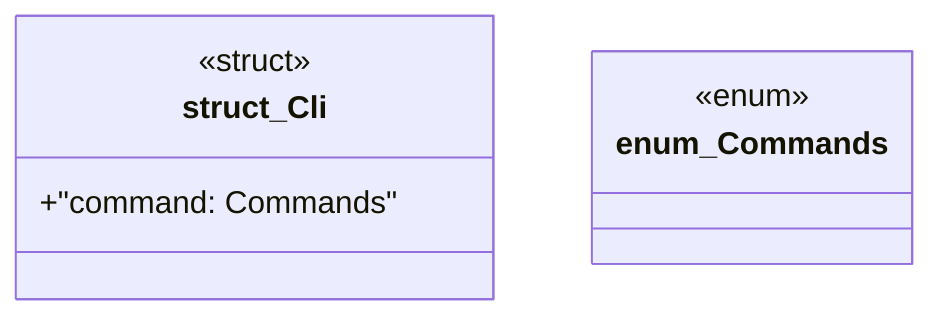

# `marketplace/packages/reasoner-cli/src/main.rs`

Source SHA-256: `2ca90f91ce03a852382526d635bbf8dfc17230c2c4e4dc554c30596bca2bd058`

## Dependencies

- `clap::Parser`
- `reasoner_cli::{ClassifierCmd, OntologyCmd, InferenceCmd, ValidatorCmd, Result}`

## Standing

- Structural parse: `ALIVE`
- Runtime behavior: `UNKNOWN`
