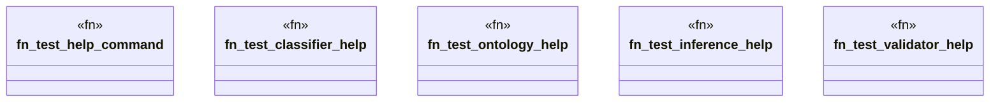

# `marketplace/packages/reasoner-cli/tests/integration_test.rs`

Source SHA-256: `23b4e0bf9e430f5933d4accc27927bbcbece76068c8e2b3f4927f220ed5c1a6a`

## Dependencies

- `std::process::Command`

## Standing

- Structural parse: `ALIVE`
- Runtime behavior: `UNKNOWN`
