# `marketplace/packages/rest-api-template/templates/rust/main.rs`

Source SHA-256: `7fb82e2a9edca6358aee396d9becdb1dfe9265edbe31a31a11c6c827963e11bc`

```mermaid
classDiagram
    class struct_User {
      <<struct>>
      +"id: Option~i64~"
      +"username: String"
      +"email: String"
      +"created_at: Option~String~"
    }
    class struct_CreateUserRequest {
      <<struct>>
      +"username: String"
      +"email: String"
    }
    class struct_UpdateUserRequest {
      <<struct>>
      +"username: Option~String~"
      +"email: Option~String~"
    }
    class struct_QueryParams {
      <<struct>>
      +"page: Option~u32~"
      +"limit: Option~u32~"
    }
    class struct_ApiResponse {
      <<struct>>
      +"success: bool"
      +"data: Option~T~"
      +"error: Option~String~"
    }
    class struct_AppState {
      <<struct>>
      +"db: Arc~DatabasePool~"
    }
    class struct_DatabasePool {
      <<struct>>
      +"users: Arc~tokio::sync::RwLock~Vec~User~~~"
    }
    class fn_create_router {
      <<fn>>
    }
    class mod_tests {
      <<mod>>
    }
    note "DatabasePool"
```

## Dependencies

- `axum::http::Request`
- `axum::{ extract::{Path, Query, State}, http::{HeaderMap, StatusCode}, response::Json, routing::{delete, get, patch, post, put}, Router, }`
- `serde::{Deserialize, Serialize}`
- `std::sync::Arc`
- `super::*`
- `tokio::net::TcpListener`
- `tower::ServiceBuilder`
- `tower::ServiceExt`
- `tower_http::{ cors::CorsLayer, trace::TraceLayer, validate_request::ValidateRequestHeaderLayer, }`

## Standing

- Structural parse: `ALIVE`
- Runtime behavior: `UNKNOWN`
