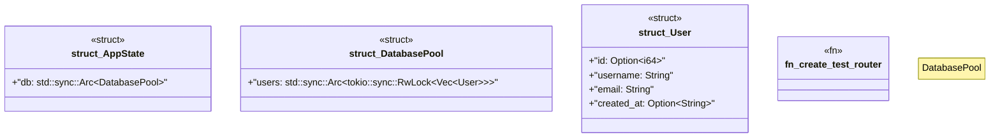

# `marketplace/packages/rest-api-template/tests/chicago_tdd/integration_tests.rs`

Source SHA-256: `36c0b92e87e9bf4554c0719fd22acbbc3cf55ff15d003c3ed18cb6df14fac979`

## Dependencies

- `axum::{ body::Body, http::{Request, StatusCode}, }`
- `axum::{ extract::{Path, State}, response::Json, routing::{delete, get, post}, }`
- `serde_json::{json, Value}`
- `testcontainers::{clients::Cli, images::postgres::Postgres, Container}`
- `tower::ServiceExt`

## Standing

- Structural parse: `ALIVE`
- Runtime behavior: `UNKNOWN`
