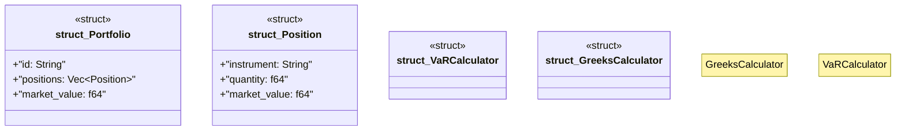

# `marketplace/packages/risk-management/src/rust/lib.rs`

Source SHA-256: `e0e7042cb3e394ee258f308c798f25b2633569301b138cfd4a77c26251629eb8`

## Dependencies

- `rand::Rng`
- `serde::{Deserialize, Serialize}`
- `std::collections::HashMap`

## Standing

- Structural parse: `ALIVE`
- Runtime behavior: `UNKNOWN`
