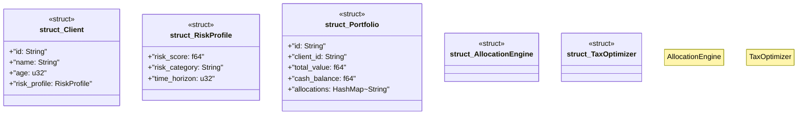

# `marketplace/packages/robo-advisor/src/rust/lib.rs`

Source SHA-256: `f8a59487e5c51aad931fb2637e53f085c18be71843379839bf6b78581e4f6b3b`

## Dependencies

- `serde::{Deserialize, Serialize}`
- `std::collections::HashMap`

## Standing

- Structural parse: `ALIVE`
- Runtime behavior: `UNKNOWN`
