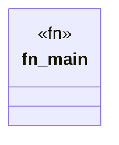

# `marketplace/packages/shacl-cli/examples/batch_validation.rs`

Source SHA-256: `4e52de686846b93b24ba243e637c419761371d98938adf4c2d6b05c4d7ce326d`

## Dependencies

- `shacl_cli::{Shape, ShapeType, Validator}`

## Standing

- Structural parse: `ALIVE`
- Runtime behavior: `UNKNOWN`
