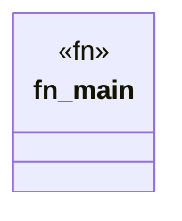

# `marketplace/packages/shacl-cli/examples/node_shape.rs`

Source SHA-256: `dc31e738b541d30d0785f42df34a25d52f6dcabc923fb1bf91c61d3adedc8b8f`

## Dependencies

- `shacl_cli::{Shape, ShapeType, Target}`

## Standing

- Structural parse: `ALIVE`
- Runtime behavior: `UNKNOWN`
