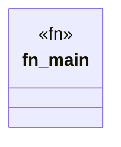

# `marketplace/packages/shacl-cli/examples/property_shape.rs`

Source SHA-256: `20d85a01dce2a2a5a19262170d7b708691dbfe0821dd73058f014e6a35bd5b80`

## Dependencies

- `shacl_cli::{Shape, ShapeType, Constraint, ConstraintType, Severity}`

## Standing

- Structural parse: `ALIVE`
- Runtime behavior: `UNKNOWN`
