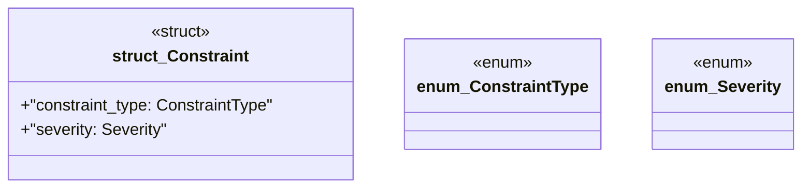

# `marketplace/packages/shacl-cli/src/constraint.rs`

Source SHA-256: `821708430e7178d8c2582b05eb0f908f7e4b97df9b6305cdabafcd0743042b55`

## Dependencies

- `crate::{Error, Result}`

## Standing

- Structural parse: `ALIVE`
- Runtime behavior: `UNKNOWN`
