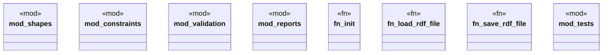

# `marketplace/packages/shacl-cli/src/lib.rs`

Source SHA-256: `6bce4bf280859945422dd5520032f6938c060342ece4ea98ae19b75fb4860ea5`

## Dependencies

- `anyhow::{Context, Result}`
- `std::path::Path`
- `super::*`

## Standing

- Structural parse: `ALIVE`
- Runtime behavior: `UNKNOWN`
