# `marketplace/packages/shacl-cli/src/main.rs`

Source SHA-256: `afb62e6b3f33a12d67c511a95cba3d018cffef4d0296bf54a2b435adf0c74946`

```mermaid
classDiagram
    class struct_Cli {
      <<struct>>
      +"command: Commands"
      +"verbose: bool"
    }
    class enum_Commands {
      <<enum>>
    }
    class enum_ShapeCommands {
      <<enum>>
    }
    class enum_ConstraintCommands {
      <<enum>>
    }
    class enum_ValidationCommands {
      <<enum>>
    }
    class enum_ReportCommands {
      <<enum>>
    }
    class fn_main {
      <<fn>>
    }
    class fn_handle_shape_command {
      <<fn>>
    }
    class fn_handle_constraint_command {
      <<fn>>
    }
    class fn_handle_validation_command {
      <<fn>>
    }
    class fn_handle_report_command {
      <<fn>>
    }
```

## Dependencies

- `anyhow::Result`
- `clap::{Parser, Subcommand}`
- `colored::*`
- `shacl_cli::*`

## Standing

- Structural parse: `ALIVE`
- Runtime behavior: `UNKNOWN`
