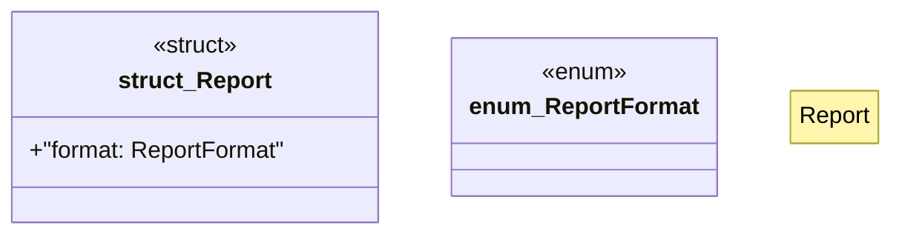

# `marketplace/packages/shacl-cli/src/report.rs`

Source SHA-256: `9c23e51a456ccebb56f657c1aca4b909678acbee670224fa42a05f0bed4942c2`

## Dependencies

- `crate::{Error, Result}`

## Standing

- Structural parse: `ALIVE`
- Runtime behavior: `UNKNOWN`
