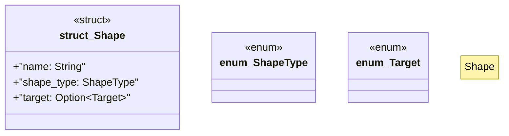

# `marketplace/packages/shacl-cli/src/shape.rs`

Source SHA-256: `988939565fc8b6bace3fabd2498a7e366e4dd6965ba8c5a656b820b5e2f81d17`

## Dependencies

- `crate::{Error, Result}`

## Standing

- Structural parse: `ALIVE`
- Runtime behavior: `UNKNOWN`
