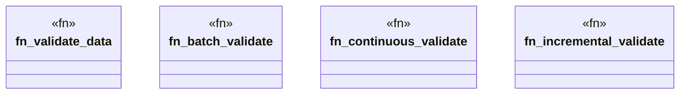

# `marketplace/packages/shacl-cli/src/validation.rs`

Source SHA-256: `4d5e503408a7cc1df7a955e35cdf5bb59918f16a00a93445cdc0cfecaddc78ab`

## Dependencies

- `anyhow::Result`
- `colored::*`
- `std::path::Path`

## Standing

- Structural parse: `ALIVE`
- Runtime behavior: `UNKNOWN`
