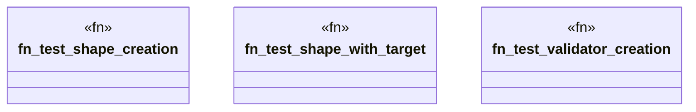

# `marketplace/packages/shacl-cli/tests/integration_test.rs`

Source SHA-256: `238a805ff7f90bbaa352a494413c97a94c158f64478ef10a72bcafba94ea0a6e`

## Dependencies

- `shacl_cli::{Shape, ShapeType, Target, Validator}`

## Standing

- Structural parse: `ALIVE`
- Runtime behavior: `UNKNOWN`
