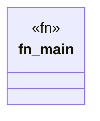

# `marketplace/packages/sparql-cli/examples/basic.rs`

Source SHA-256: `afb22b232815ead489602af76593b39d85164644a8061ede238c270481ff7568`

## Dependencies

- `anyhow::Result`

## Standing

- Structural parse: `ALIVE`
- Runtime behavior: `UNKNOWN`
