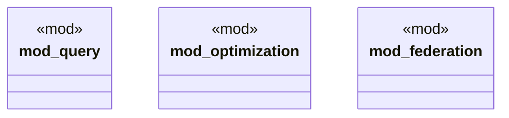

# `marketplace/packages/sparql-cli/src/lib.rs`

Source SHA-256: `7da1324141b232293c94591e1abf3533618007071615ef930782a174ab04437f`

## Dependencies

- `anyhow::Result`

## Standing

- Structural parse: `ALIVE`
- Runtime behavior: `UNKNOWN`
