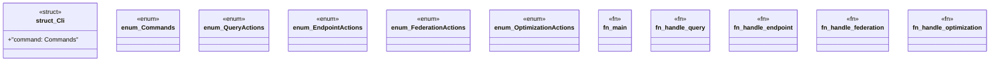

# `marketplace/packages/sparql-cli/src/main.rs`

Source SHA-256: `51f394834526e3e5aeb9d9cadec99e89d2a6483575bd2ef558d46d64b096fbca`

## Dependencies

- `anyhow::Result`
- `clap::Parser`

## Standing

- Structural parse: `ALIVE`
- Runtime behavior: `UNKNOWN`
