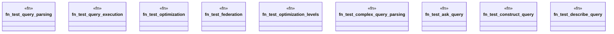

# `marketplace/packages/sparql-cli/tests/integration_test.rs`

Source SHA-256: `c8383698739c157c0b6175caf2c673c65751da8733cce733a05e6f473f2d841f`

## Dependencies

- `sparql_cli::{query, optimization, federation}`

## Standing

- Structural parse: `ALIVE`
- Runtime behavior: `UNKNOWN`
