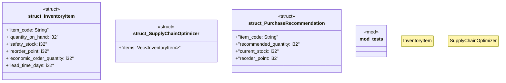

# `marketplace/packages/supply-chain-management/templates/rust/supply_chain_engine.rs`

Source SHA-256: `2d620a88459241c763ec136cae623c1aad23d6f92041f7f1b696958cff006823`

## Dependencies

- `rust_decimal::Decimal`
- `serde::{Deserialize, Serialize}`
- `super::*`

## Standing

- Structural parse: `ALIVE`
- Runtime behavior: `UNKNOWN`
