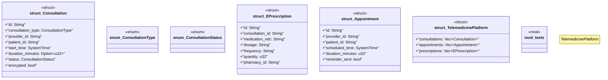

# `marketplace/packages/telemedicine-platform/src/lib.rs`

Source SHA-256: `090bf9ec3c8933c438ddb0b809b3b110f3a8edbe33be289b1d89d3eff01c95b1`

## Dependencies

- `serde::{Deserialize, Serialize}`
- `std::time::SystemTime`
- `super::*`

## Standing

- Structural parse: `ALIVE`
- Runtime behavior: `UNKNOWN`
