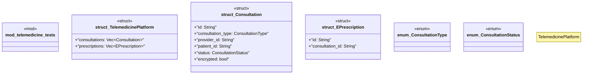

# `marketplace/packages/telemedicine-platform/tests/chicago_tdd.rs`

Source SHA-256: `7805ae1ba9d7e27a03b3f7bdf134cd53faedf3f6a25129d31f0cbc02bbcdb628`

## Dependencies

- `super::*`

## Standing

- Structural parse: `ALIVE`
- Runtime behavior: `UNKNOWN`
